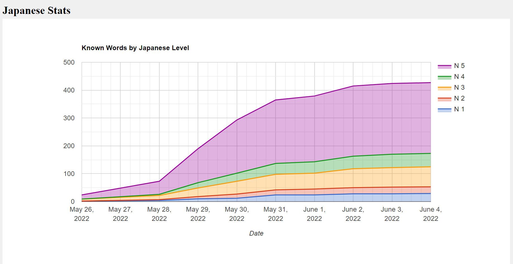
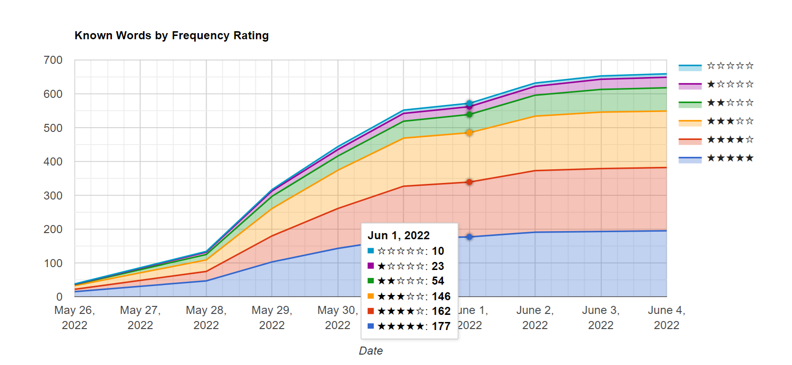

# JapaneseStats
Anki Addon for JLPT Stats
based on rjoudrey/chinese_stats https://github.com/rjoudrey/chinese_stats 真的太酷了👍

**ankiweb https://ankiweb.net/shared/info/885817521**

# Usage
1. ✨Download 
To download this add-on, please copy and paste the following code into Anki 2.1:  885817521

2. ⚙️Configure it

Tools -> Add-ons -> JLPT-stats -> Config.
For every japanese deck, please select which note field to search for japanese words.
Don't worry, same word won't be counted twice, so you can apply this addon for japanese decks as many as possible.
And in one pharse there are one or more words can be counted, in other words, even filling an article in selected field is okay👌(maybe you don't care about performance).

3. 😎Display!

Tools -> JLPT-stats

4. 😆Have fun!

# preview

